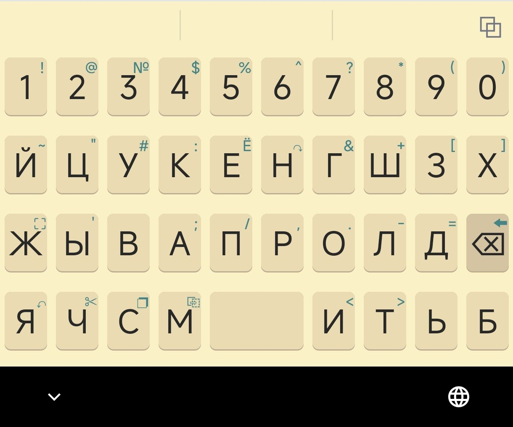
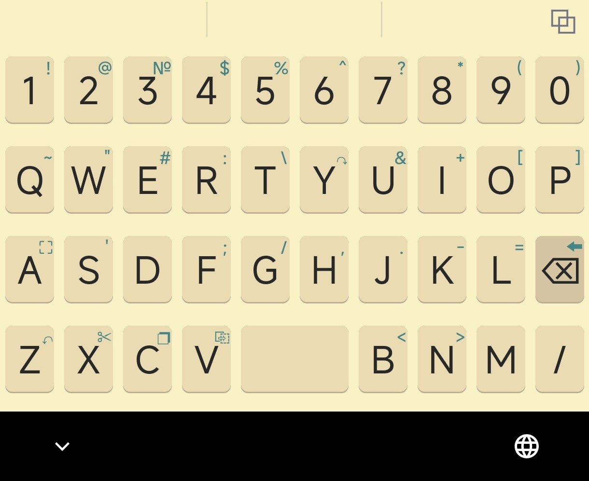

# kazuar

**kazuar** is a 100% FOSS keyboard, forked from [KeyMapperOpenBoard](https://github.com/keymapperorg/KeyMapperOpenBoard) (which is built upon OpenBoard and the AOSP keyboard).

> [!NOTE]
> A cassowary (kazuar) is a large flightless bird native to the tropical forests of New Guinea and nearby islands.

This project is optimized and designed to support **only Russian and English languages**. All other languages and layout assets have been removed, which successfully reduced the application's size by 5 times.

## Why

This project was born out of a long search for a keyboard application that allowed comprehensive layout customization. Existing options on the market were too limited for these specific requirements:

* **Consistent Key Positioning**: A keyboard layout where keys do not shift or change size when toggling between languages (maintaining large, easy-to-click buttons).
* **No Crowded Symbol Layers**: Finding basic punctuation like a question mark shouldn't require digging through layers of symbol menus. In **kazuar**, there is no separate symbols layer; symbols are accessed via long-pressing letter keys, or through a dedicated editing/navigation layout.
* **Taps Over Swipes**: Swipe typing is often a guessing game where a small inaccuracy completely alters the meaning of a word. Traditional tap typing is more reliable; even with occasional typos, the original meaning of the text is preserved.
* **Gestures for Actions**: While swipe typing is disabled, swipe gestures are used for navigation and quick actions: switching languages, deleting words, moving the cursor, toggling Shift, switching layouts, and pressing Enter. These can be configured in the settings under **Advanced** -> **Setup swipe controls**.
* **Multi-Tap secondary letters**: To keep the keys large without moving them around, some secondary letters are placed behind a double-tap of primary letters, functioning similarly to multi-tap systems on classic physical mobile phones.

## Screenshot Previews (V3 Light Theme)

### Russian Layout

### English Layout

more pics: [here](pics/README.md)

## Documentation

For instructions on customizing and configuring the keyboard, please refer to the documentation files in the [docs](docs) directory:

* [Custom Layout XML Format](docs/layout_format.md) — How to define and load custom keyboard layouts.
* [Custom Theme JSON Format](docs/theme_format.md) — How to load and customize theme colors.
* [Layout Reference](docs/default_layouts.md) — Reference documentation on the default layout versions (V1, V2, V3) and edit mode.
* [Color Palette Reference](docs/gruvbox_colors.md) — Reference for theme colors (e.g., Gruvbox palette).
* [Icon Reference](docs/utf8_icons.md) — List of unicode characters used for functional keys.
* [Settings Menu Outline](docs/app_menu.md) — Overview of available menu options and settings.

## Versioning

This project uses [Calendar Versioning (CalVer)](https://calver.org/) with the format `YY.MM.DD` (e.g., `26.08.10` for releases created on August 10, 2026).

## Acknowledgements

We would like to express our gratitude to the talented artists who designed the application icons:

* [aroum](https://github.com/aroum)
* [vrifmus](https://github.com/vrifmus)
* [PavelAltynnikov](https://github.com/PavelAltynnikov/)

Detailed credits, authorship info, and preview images can be found in the [Icon README](logo/README.md).
