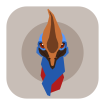

# Icon Authorship & Credits

Special thanks to the talented designers who created the application icons:

* **[aroum](https://github.com/aroum/)**

  

* **[vrifmus](https://github.com/vrifmus/)**
  
  

* **[PavelAltynnikov](https://github.com/PavelAltynnikov/)**
  
  

You can switch between different icon styles in the application settings under **Appearance & Layouts** -> **Select icon style**.
